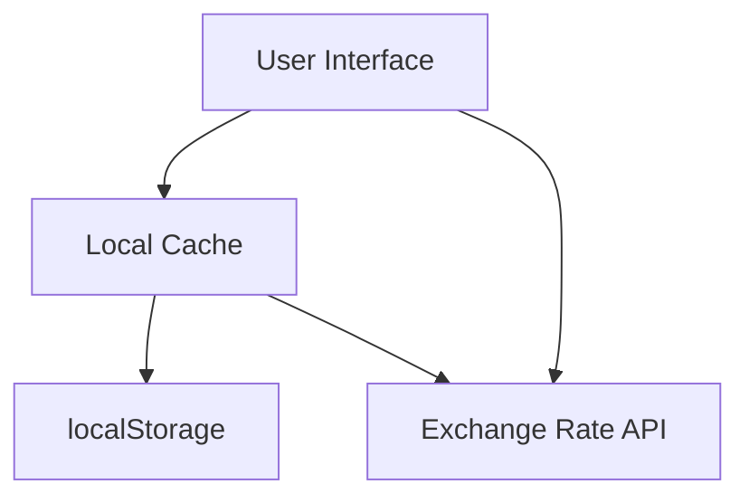
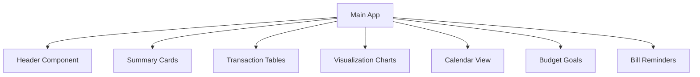
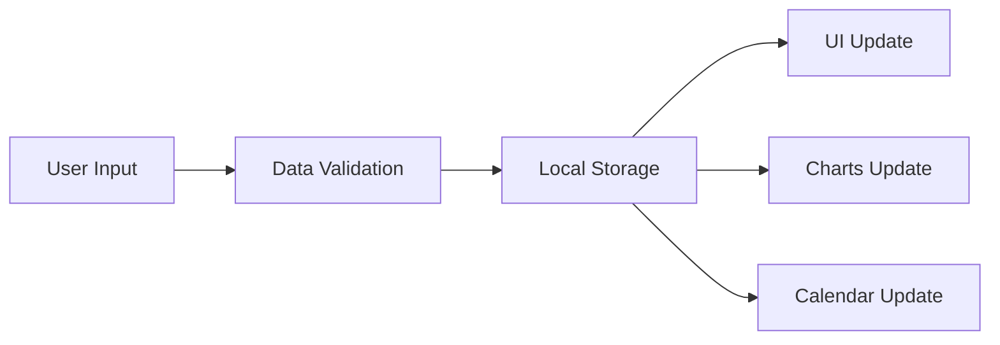

# System Patterns

## Architecture Overview

### Progressive Web App Architecture
- **Client-Side Rendering**: Pure frontend application
- **Local Storage**: IndexedDB for offline data persistence
- **Service Workers**: Offline functionality and caching
- **PWA Manifest**: Installation and mobile device integration

### Data Management


## Design Patterns

### Module Pattern
- Separate JavaScript modules for distinct functionality:
  - Payment management
  - Income tracking
  - Savings goals
  - Budget control
  - Bill reminders
  - Data visualization

### Observer Pattern
- Event-driven updates for:
  - Exchange rate changes
  - Budget limit notifications
  - Bill payment reminders
  - Savings goal progress

### Factory Pattern
- Creation of transaction objects
- Generation of recurring payments
- Initialization of savings goals
- Chart generation

### Singleton Pattern
- Exchange rate service
- Theme management
- Local storage wrapper
- Calendar instance

## Component Architecture

### UI Components


### Data Flow


## Technical Implementation

### State Management
- LocalStorage for persistent data
- In-memory state for active session
- Event-based state synchronization
- Atomic updates for data consistency

### Data Models
```javascript
// Transaction Model
{
  name: string,
  amount: number,
  currency: string,
  date: Date,
  frequency: string,
  category?: string
}

// Savings Goal Model
{
  name: string,
  targetAmount: number,
  currentAmount: number,
  currency: string,
  startDate: Date,
  targetDate: Date
}

// Budget Model
{
  monthlyLimit: number,
  categories: Array<{
    name: string,
    limit: number
  }>
}

// Bill Reminder Model
{
  name: string,
  dueDay: number,
  reminderDays: number
}
```

### Event System
- Custom event dispatchers for:
  - Transaction updates
  - Budget alerts
  - Bill reminders
  - Exchange rate updates
  - Theme changes

### Caching Strategy
- Service Worker caching for:
  - Static assets
  - Application shell
  - API responses
- LocalStorage for:
  - User preferences
  - Transaction history
  - Budget settings

## Security Patterns

### Data Protection
- Client-side data encryption
- Secure export/import process
- Input sanitization
- XSS prevention

### Error Handling
- Graceful degradation
- Comprehensive error logging
- User-friendly error messages
- Data recovery mechanisms

## Performance Patterns

### Loading Optimization
- Lazy loading of components
- Asset preloading
- Efficient DOM updates
- Memory management

### Computational Efficiency
- Memoization for calculations
- Batch processing
- Efficient data structures
- Optimized algorithms

## Responsive Design Patterns

### Layout Structure
- CSS Grid system
- Flexbox layouts
- Mobile-first approach
- Responsive breakpoints

### Theme Implementation
- CSS variables
- Dynamic theme switching
- Consistent color schemes
- Accessibility considerations

## Testing Patterns

### Unit Testing
- Component isolation
- Function testing
- Event handling
- Data validation

### Integration Testing
- Component interaction
- Data flow
- State management
- Event propagation

## Deployment Pattern

### Build Process
- Asset optimization
- Code minification
- Bundle splitting
- Cache management

### Version Control
- Feature branches
- Semantic versioning
- Change documentation
- Release management
