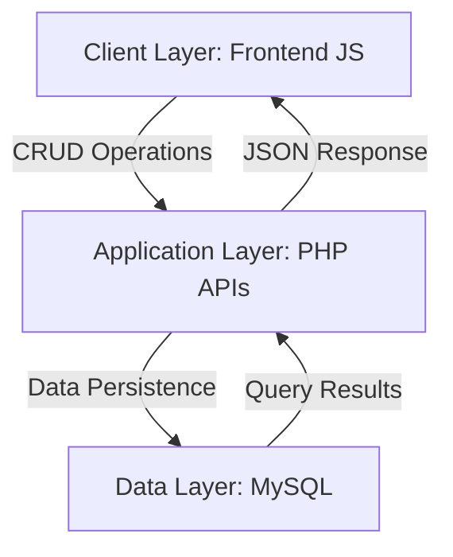
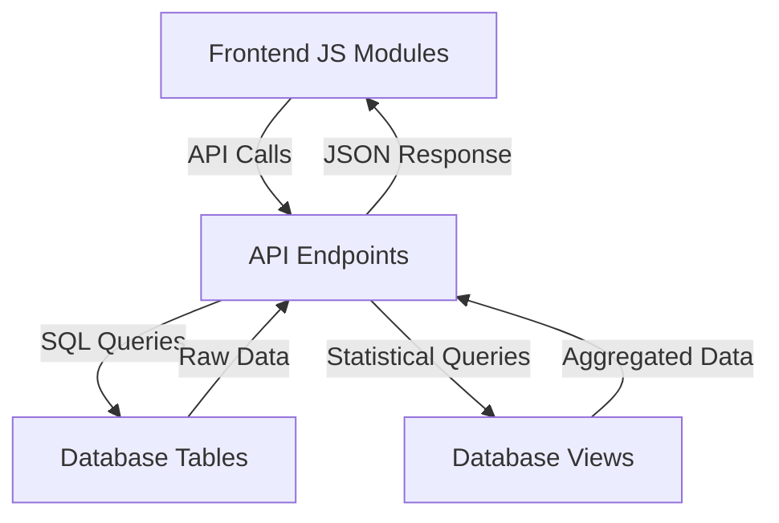
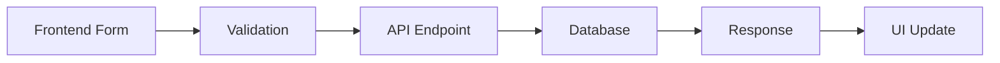
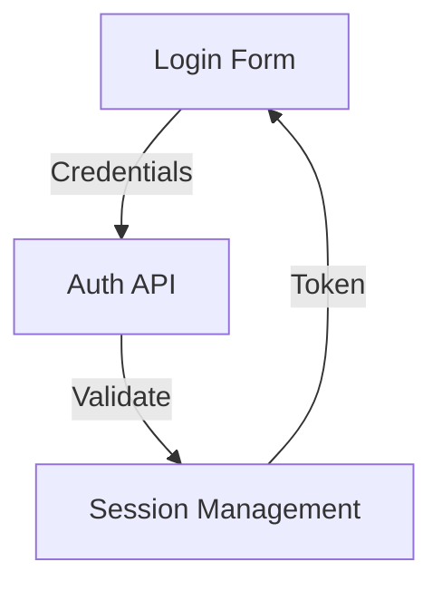
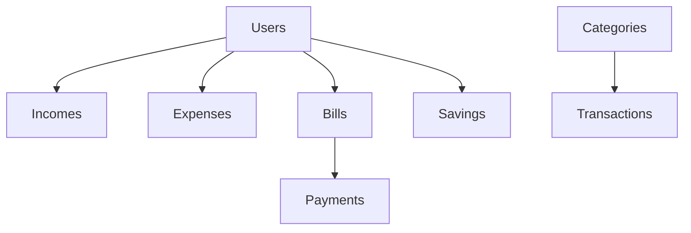

# System Patterns: Personal Finance Management System

## Architecture Overview

### System Architecture



### Component Integration



## Design Patterns

### 1. Data Flow Pattern

```javascript
// Frontend Request Pattern
async function handleDataOperation() {
    try {
        // 1. Form Data Collection
        const data = formDataToJSON(form);
        data.csrf_token = CSRF_TOKEN;

        // 2. API Request
        const response = await fetchAPI('/api/endpoint', {
            method: 'METHOD',
            body: JSON.stringify(data)
        });

        // 3. Response Handling
        if (response.success) {
            // Success actions
        } else {
            throw new Error(response.error);
        }
    } catch (error) {
        // Error handling
    }
}
```

```php
// API Response Pattern
try {
    // 1. Input Validation
    validateInput($data);

    // 2. Database Operation
    $pdo->beginTransaction();
    // ... database operations
    $pdo->commit();

    // 3. Response
    echo json_encode([
        'success' => true,
        'data' => $result
    ]);
} catch (Exception $e) {
    $pdo->rollBack();
    http_response_code(400);
    echo json_encode(['error' => $e->getMessage()]);
}
```

### 2. Database Integration Pattern

```sql
-- Table Structure Pattern
CREATE TABLE entity (
    id INT PRIMARY KEY AUTO_INCREMENT,
    user_id INT NOT NULL,
    -- Entity specific fields
    status ENUM(...) DEFAULT '...',
    created_at TIMESTAMP DEFAULT CURRENT_TIMESTAMP,
    updated_at TIMESTAMP DEFAULT CURRENT_TIMESTAMP ON UPDATE CURRENT_TIMESTAMP,
    FOREIGN KEY (user_id) REFERENCES users(id) ON DELETE CASCADE
);

-- View Pattern
CREATE VIEW entity_summary AS
SELECT 
    entity.*,
    related_data
FROM entity
JOIN related_tables
WHERE conditions;
```

### 3. Frontend Module Pattern

```javascript
// Module Organization
class ModuleManager {
    // 1. Data Loading
    async loadData() {
        // Fetch and display data
    }

    // 2. Form Handling
    async handleForm(event) {
        // Process form submission
    }

    // 3. UI Updates
    updateUI(data) {
        // Update interface
    }

    // 4. Error Handling
    handleError(error) {
        // Display error messages
    }
}
```

## Implementation Patterns

### 1. CRUD Operations



### 2. Data Validation

```javascript
// Frontend Validation
const validateForm = (data) => {
    // Type checking
    // Format validation
    // Business rules
};
```

```php
// Backend Validation
function validateInput($data) {
    // Required fields
    // Data types
    // Business logic
}
```

### 3. Error Handling

```javascript
// Frontend Error Handling
try {
    await operation();
} catch (error) {
    handleError(error);
}
```

```php
// Backend Error Handling
try {
    // Operation
} catch (Exception $e) {
    logError($e);
    return errorResponse($e);
}
```

## Security Patterns

### 1. Authentication Flow



### 2. Data Protection

```php
// Security Measures
- CSRF Protection
- Input Sanitization
- Prepared Statements
- Transaction Safety
```

## Database Patterns

### 1. Table Relationships



### 2. Data Access

```php
// Data Access Pattern
class DataAccess {
    // CRUD Operations
    // Transaction Management
    // Error Handling
    // Result Processing
}
```

## Frontend Patterns

### 1. Component Structure

```javascript
// Component Pattern
class Component {
    constructor() {
        // Initialize
    }
    
    render() {
        // Display
    }
    
    handleEvents() {
        // Event Management
    }
}
```

### 2. State Management

```javascript
// State Management Pattern
class StateManager {
    // Data Storage
    // Event Handling
    // UI Updates
}
```

## Integration Patterns

### 1. API Communication

```javascript
// API Client Pattern
class APIClient {
    // Request Formatting
    // Response Handling
    // Error Management
}
```

### 2. Data Synchronization

```javascript
// Sync Pattern
class DataSync {
    // Change Detection
    // Update Propagation
    // Conflict Resolution
}
```

## Testing Patterns

### 1. Test Organization

```javascript
// Test Structure
describe('Module', () => {
    // Unit Tests
    // Integration Tests
    // UI Tests
});
```

### 2. Test Data

```php
// Test Data Pattern
class TestData {
    // Data Generation
    // State Setup
    // Cleanup
}
```

## Maintenance Patterns

### 1. Logging

```php
// Logging Pattern
function logActivity($type, $data) {
    // Event Recording
    // Error Tracking
    // Audit Trail
}
```

### 2. Monitoring

```php
// Monitoring Pattern
class SystemMonitor {
    // Performance Tracking
    // Error Detection
    // Health Checks
}
