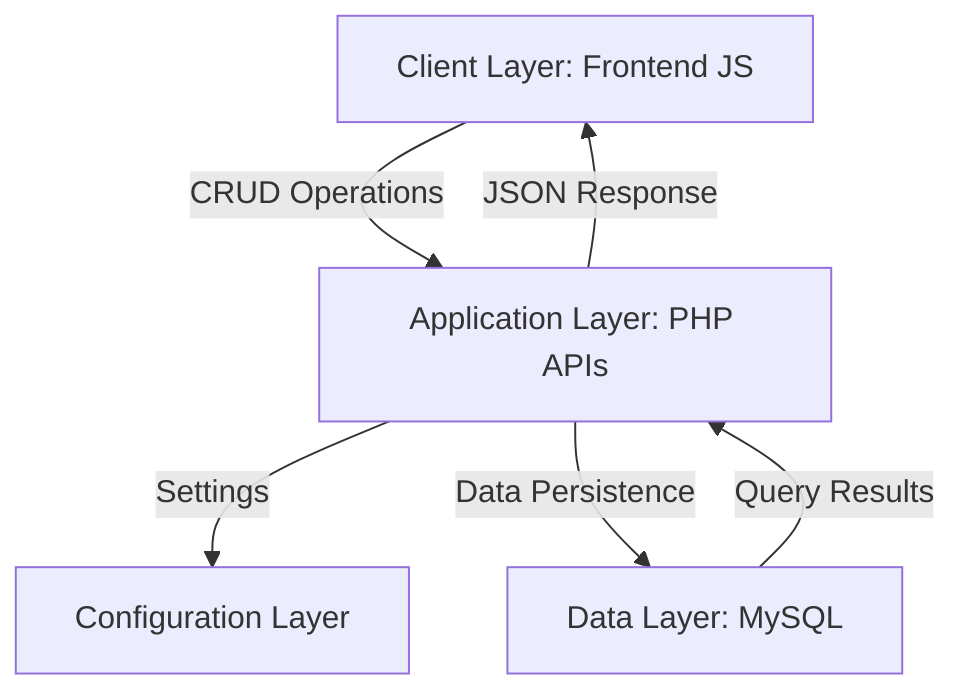
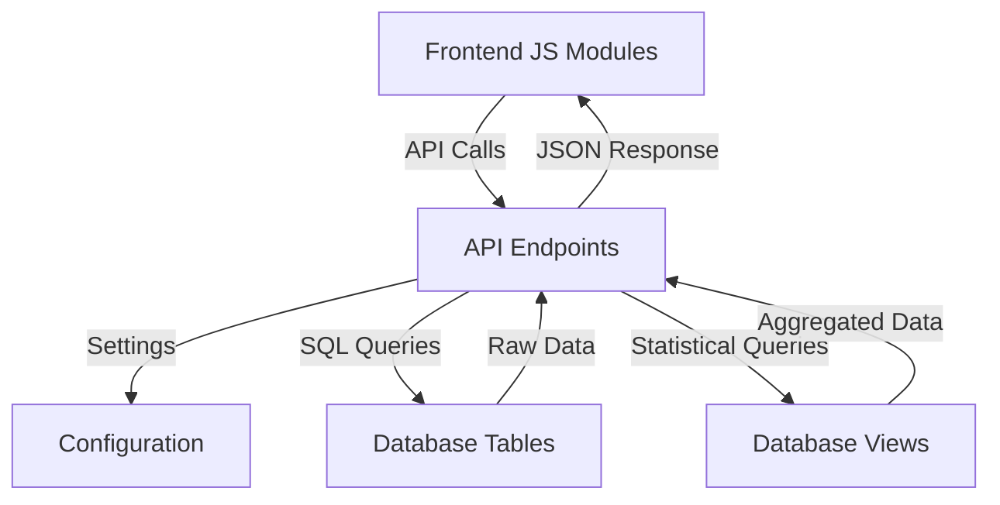
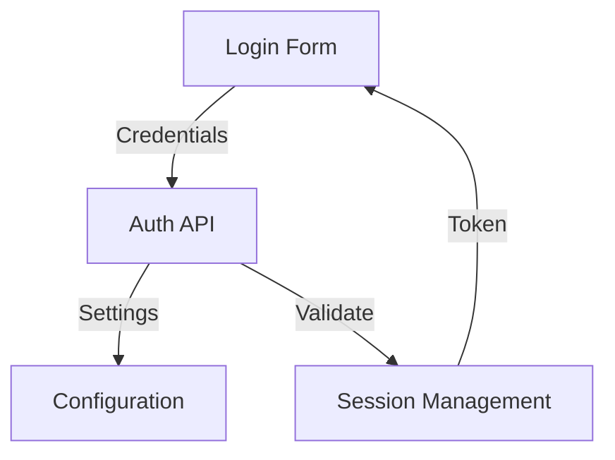

# System Patterns: Personal Finance Management System

## Configuration Pattern

### Unified Configuration Structure

```php
// Central Configuration File (includes/config.php)
├── Application Settings
│   ├── App constants
│   ├── Database settings
│   └── Security parameters
│
├── Feature Settings
│   ├── Currency support
│   ├── Categories
│   └── Notifications
│
└── Helper Functions
    ├── Validation
    ├── Formatting
    └── Cache management
```

### Include Pattern

```php
// API Endpoints
require_once '../includes/config.php';  // Central configuration
require_once '../includes/db.php';      // Database connection
require_once '../includes/functions.php'; // Helper functions
```

### Category Management Pattern

```php
// Database-Driven Categories
CREATE TABLE categories (
    id INT PRIMARY KEY AUTO_INCREMENT,
    user_id INT NOT NULL,
    name VARCHAR(50) NOT NULL,
    display_name VARCHAR(50) NOT NULL,
    type ENUM('income', 'expense') NOT NULL,
    icon VARCHAR(50),
    color VARCHAR(7),
    is_default BOOLEAN DEFAULT FALSE,
    parent_id INT,
    created_at TIMESTAMP DEFAULT CURRENT_TIMESTAMP,
    updated_at TIMESTAMP DEFAULT CURRENT_TIMESTAMP ON UPDATE CURRENT_TIMESTAMP,
    FOREIGN KEY (user_id) REFERENCES users(id) ON DELETE CASCADE,
    FOREIGN KEY (parent_id) REFERENCES categories(id) ON DELETE CASCADE,
    UNIQUE KEY unique_category (user_id, name, type)
);

// Category Validation Pattern
function validateCategory($category, $type = 'expense') {
    global $pdo;
    $stmt = $pdo->prepare("SELECT COUNT(*) FROM categories WHERE name = :name AND type = :type");
    $stmt->execute(['name' => $category, 'type' => $type]);
    return $stmt->fetchColumn() > 0;
}

// Category Creation Pattern
if (!empty($data['category'])) {
    $stmt = $pdo->prepare("SELECT id FROM categories WHERE user_id = ? AND name = ? AND type = ?");
    $stmt->execute([$user_id, $data['category'], $type]);
    $category = $stmt->fetch();
    
    if (!$category) {
        // Create new category
        $stmt = $pdo->prepare("
            INSERT INTO categories (user_id, name, display_name, type, color, icon)
            VALUES (?, ?, ?, ?, ?, ?)
        ");
        $stmt->execute([
            $user_id,
            $data['category'],
            $data['category_display_name'] ?? $data['category'],
            $type,
            $data['category_color'] ?? '#' . substr(md5($data['category']), 0, 6),
            $data['category_icon'] ?? null
        ]);
        $category_id = $pdo->lastInsertId();
    } else {
        $category_id = $category['id'];
    }
}
```

## Architecture Overview

### System Architecture



### Component Integration



## Design Patterns

### 1. Data Flow Pattern

```javascript
// Frontend Request Pattern
async function handleDataOperation() {
    try {
        // 1. Form Data Collection
        const data = formDataToJSON(form);
        data.csrf_token = CSRF_TOKEN;

        // 2. API Request
        const response = await fetchAPI('/api/endpoint', {
            method: 'METHOD',
            body: JSON.stringify(data)
        });

        // 3. Response Handling
        if (response.success) {
            // Success actions
        } else {
            throw new Error(response.error);
        }
    } catch (error) {
        // Error handling
    }
}
```

```php
// API Response Pattern
try {
    // 1. Input Validation
    validateInput($data);

    // 2. Database Operation
    $pdo->beginTransaction();
    // ... database operations
    $pdo->commit();

    // 3. Response
    echo json_encode([
        'success' => true,
        'data' => $result
    ]);
} catch (Exception $e) {
    $pdo->rollBack();
    http_response_code(400);
    echo json_encode(['error' => $e->getMessage()]);
}
```

### 2. Database Integration Pattern

```sql
-- Table Structure Pattern
CREATE TABLE entity (
    id INT PRIMARY KEY AUTO_INCREMENT,
    user_id INT NOT NULL,
    -- Entity specific fields
    status ENUM(...) DEFAULT '...',
    created_at TIMESTAMP DEFAULT CURRENT_TIMESTAMP,
    updated_at TIMESTAMP DEFAULT CURRENT_TIMESTAMP ON UPDATE CURRENT_TIMESTAMP,
    FOREIGN KEY (user_id) REFERENCES users(id) ON DELETE CASCADE
);

-- View Pattern
CREATE VIEW entity_summary AS
SELECT 
    entity.*,
    related_data
FROM entity
JOIN related_tables
WHERE conditions;
```

### 3. Frontend Module Pattern

```javascript
// Module Organization
class ModuleManager {
    // 1. Data Loading
    async loadData() {
        // Fetch and display data
    }

    // 2. Form Handling
    async handleForm(event) {
        // Process form submission
    }

    // 3. UI Updates
    updateUI(data) {
        // Update interface
    }

    // 4. Error Handling
    handleError(error) {
        // Display error messages
    }
}
```

## Implementation Patterns

### 1. Configuration Usage

```php
// Configuration Access Pattern
define('CONFIG_CONSTANT', 'value');
function getConfig($key, $default = null) {
    return defined($key) ? constant($key) : $default;
}
```

### 2. API Endpoint Pattern

```php
// Standard API Structure
header('Content-Type: application/json');
require_once '../includes/config.php';
require_once '../includes/db.php';
require_once '../includes/functions.php';

// Authentication check
if (!isLoggedIn()) {
    http_response_code(401);
    die(json_encode(['error' => 'Unauthorized']));
}

// Request handling
switch ($_SERVER['REQUEST_METHOD']) {
    case 'GET':    // Read operations
    case 'POST':   // Create operations
    case 'PUT':    // Update operations
    case 'DELETE': // Delete operations
}
```

### 3. Error Handling Pattern

```php
// Centralized Error Handling
function handleError($error) {
    logError($error);
    return [
        'success' => false,
        'error' => getErrorMessage($error)
    ];
}
```

## Security Patterns

### 1. Authentication Flow



### 2. Data Protection Pattern

```php
// Security Implementation
class SecurityManager {
    // CSRF Protection
    // Input Sanitization
    // Session Management
    // Error Handling
}
```

## Testing Patterns

### 1. Test Organization

```php
// Test Structure
class EndpointTest extends TestCase {
    // Configuration Tests
    // API Tests
    // Integration Tests
}
```

### 2. Test Data Pattern

```php
// Test Data Management
class TestData {
    // Sample Data Generation
    // State Management
    // Cleanup Operations
}
```

## Maintenance Patterns

### 1. Logging Pattern

```php
// Activity Logging
function logActivity($type, $data) {
    // Event Recording
    // Error Tracking
    // Audit Trail
}
```

### 2. Monitoring Pattern

```php
// System Monitoring
class SystemMonitor {
    // Performance Tracking
    // Error Detection
    // Health Checks
}
